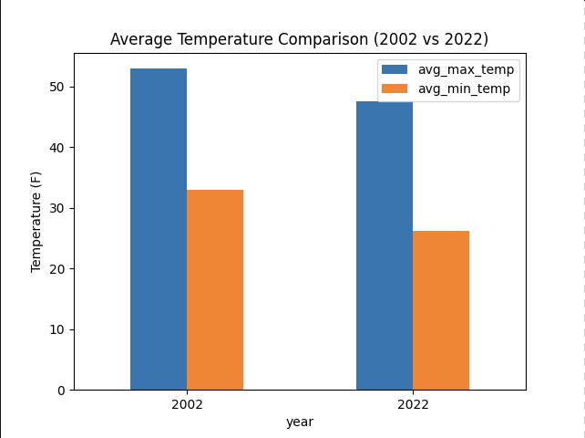
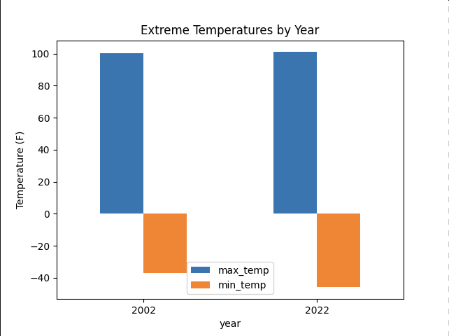
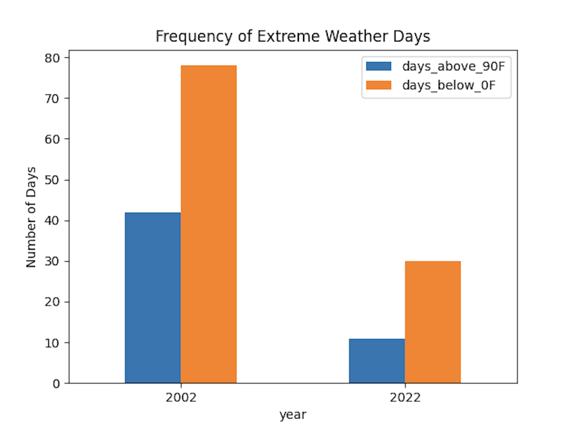
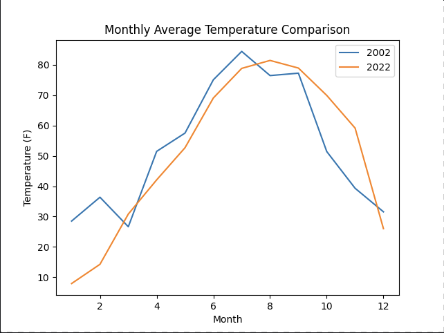
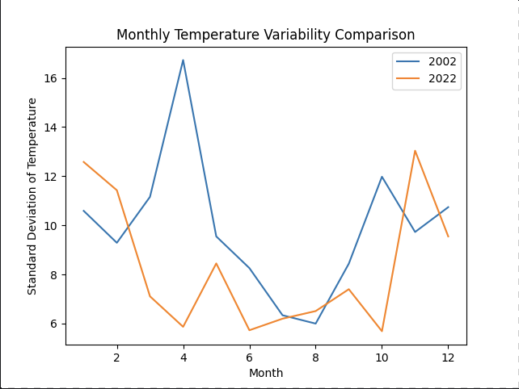

# Weather Data Pipeline Project

## Overview
This project analyzes Minnesota weather trends using NOAA climate data collected through a cloud-based ETL pipeline. The goal was to compare weather patterns across a 20-year period, focusing on temperature variability, precipitation, and extreme weather events.

## Technologies Used
- Python
- Apache NiFi
- AWS S3
- PySpark
- NOAA Climate Data API
- Matplotlib

## Project Workflow
1. Collected NOAA weather data using API requests.
2. Used Apache NiFi to automate data ingestion.
3. Stored raw JSON weather data in AWS S3.
4. Processed and transformed the data using PySpark.
5. Created visualizations to compare Minnesota weather patterns between 2002 and 2022.

## Architecture
NOAA API → Apache NiFi → AWS S3 → PySpark → Analysis & Visualizations

## Key Features
- API-based data collection with pagination
- Cloud storage using AWS S3
- PySpark transformations for structured weather analysis
- Visualizations comparing long-term weather patterns
- Analysis of temperature, precipitation, and extreme weather days

## Key Insights
- Compared average maximum and minimum temperatures between 2002 and 2022.
- Analyzed monthly temperature patterns to identify seasonal differences.
- Examined extreme weather days to compare weather variability across years.

## Visualizations

## Future Improvements
- Automate scheduled data collection.
- Expand analysis to additional years and states.
- Build an interactive Streamlit dashboard.
- Add data validation checks for missing or inconsistent weather records.

## Author
Isabel Bennett  
M.S. Data Science Student  
Interested in data engineering, cloud computing, and healthcare analytics.
